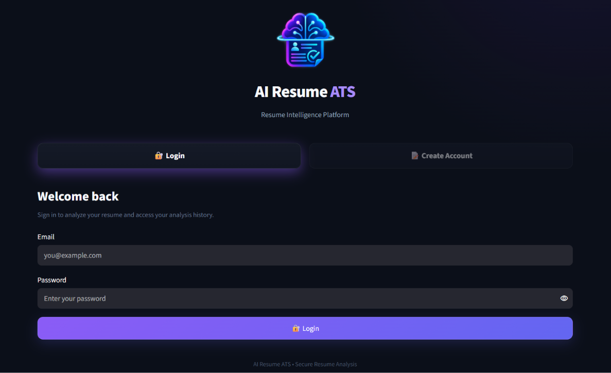
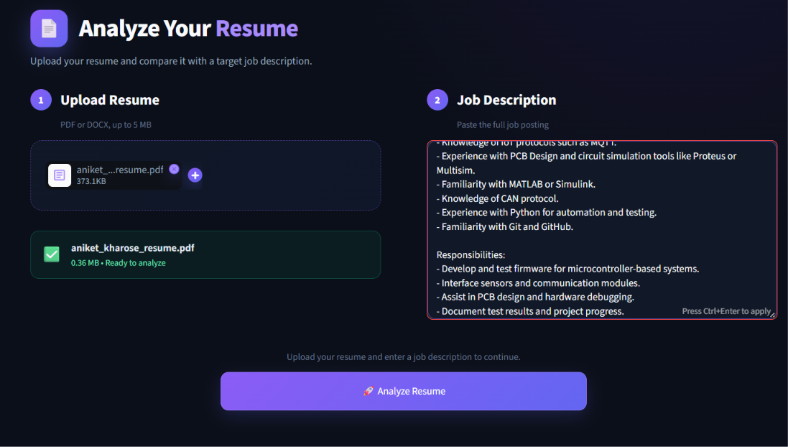
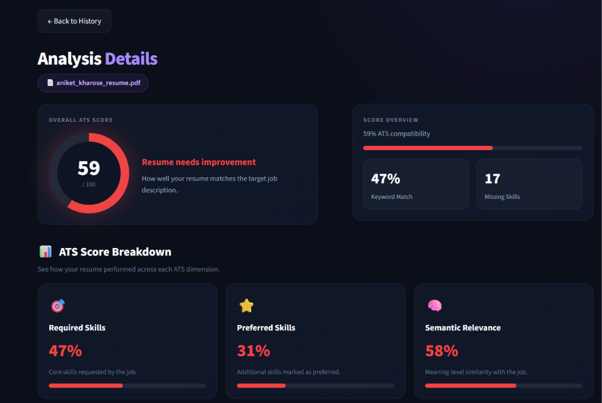
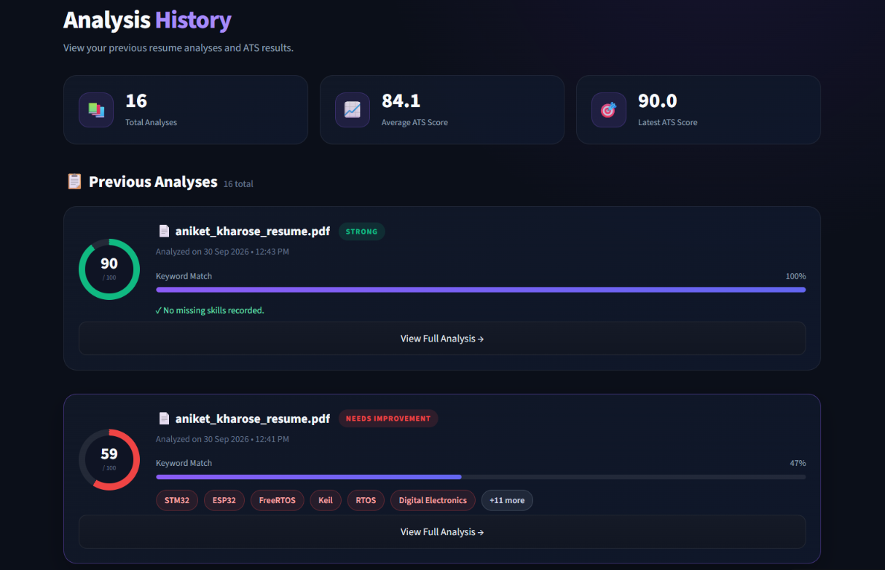
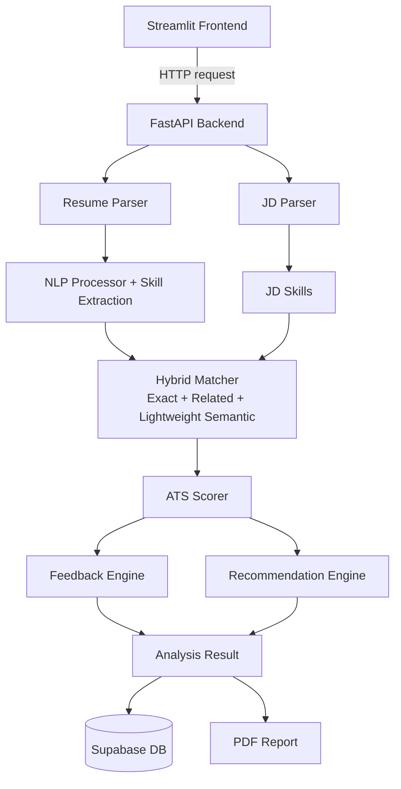

<div align="center">

# 🧠 AI Resume ATS System

**An AI-powered Applicant Tracking System that analyzes a resume against a job description and returns an ATS score, skill matching, feedback and actionable recommendations.**


[🚀 Live Demo](https://ai-resume-ats-system-aniket.streamlit.app) ·
[📘 API Docs (Swagger)](https://ai-resume-ats-api-tp6x.onrender.com/docs)

</div>

> ⏳ **Note:** The backend runs on Render's free tier, so it sleeps after inactivity. The first analysis after a break can take 30 to 60 seconds while the server wakes up. Open the [API docs](https://ai-resume-ats-api-tp6x.onrender.com/docs) once to wake it up, then run your analysis.

---

## 📸 Screenshots

| Login | Analyze Resume |
|:---:|:---:|
|  |  |

| Analysis Result | History |
|:---:|:---:|
|  |  |

---

## 📌 Overview

The AI Resume ATS System helps job seekers understand how well their resume matches a target job description.

The system processes the uploaded resume, extracts relevant information and skills, analyzes the job description, performs skill matching, calculates an ATS compatibility score, and generates feedback and recommendations.

It combines:

- Natural Language Processing
- Resume parsing and skill extraction
- Job description parsing
- Hybrid skill matching with lightweight semantic similarity
- ATS scoring, feedback and recommendation generation
- Authentication, saved analysis history and PDF reports

---

## ✨ Features

### 📄 Resume Analysis
- Upload a resume in **PDF or DOCX** format
- Extract text and detect resume sections
- Analyze resume structure
- Extract technical skills using a domain-aware skill database
- Optional Groq LLM-assisted resume parsing

### 💼 Job Description Analysis
- Parse job descriptions and detect their sections
- Extract **required** and **preferred** skills
- Classify skills by importance

### 🔍 Hybrid Skill Matching
- Exact skill matching
- Alias and normalized matching
- Lightweight semantic-style similarity
- Related technical skill detection
- Required vs preferred classification

### 📊 ATS Scoring
The overall score is built from five dimensions (see [ATS Scoring](#-ats-scoring-weights)).

### 💡 Feedback and 🚀 Recommendations
- Resume strengths and improvement areas
- Missing required and preferred skills
- Content and structure suggestions
- The system **never recommends falsely adding skills or experience** the candidate does not have

### 🔐 Authentication and 📚 History
- Sign up, login and logout with Supabase
- User-specific analysis history (filename, ATS score, keyword match, missing skills, full detail view)

### 📑 PDF Report
- Generate and download a complete ATS analysis report

### 🎨 Modern UI
- Dark, responsive Streamlit interface with a score ring, breakdown cards, skill chips and history dashboard

---

## 🏗️ System Architecture



### 🔄 How It Works

```text
Resume Upload → Text Extraction → NLP Processing → Resume Skill Extraction
      → Job Description Parsing → JD Skill Extraction → Hybrid Skill Matching
      → ATS Score → Feedback → Recommendations → Save Analysis → Display Results
```

---

## 🧠 NLP and Matching Approach

The pipeline is designed to run inside a **low-memory deployment environment** (Render free tier, 512 MB).

**Resume NLP:** spaCy (`en_core_web_sm`) handles tokenization, sentence processing and text analysis. The model is lazy-loaded to keep startup light.

**Skill extraction:** a domain-aware skill database covers Programming, AI / ML, Software Development, Embedded Systems, Electronics, IoT, Communication, Databases, Cloud / DevOps and Tools.

**Lightweight semantic matching:**

```text
Exact Match → Normalization → Abbreviation Expansion
      → Known Technical Relationships → TF-IDF Character Similarity
```

| Input | Understood as |
|---|---|
| `NLP` | Natural Language Processing |
| `ML` | Machine Learning |
| `Python Programming` | Python |

---

## 📊 ATS Scoring Weights

| Component | Weight |
|---|:---:|
| Required Skills | 50% |
| Preferred Skills | 15% |
| Semantic Relevance | 10% |
| Resume Structure | 15% |
| Content Completeness | 10% |

> **Note:** These weights are project-specific engineering choices. They are **not** an industry-standard ATS formula.

---

## 🛠️ Tech Stack

| Layer | Technologies |
|---|---|
| **Frontend** | Python, Streamlit |
| **Backend** | FastAPI, Uvicorn |
| **NLP / ML** | spaCy, scikit-learn, RapidFuzz |
| **Resume processing** | pdfplumber, PyPDF2, python-docx |
| **Database and auth** | Supabase (PostgreSQL, Row Level Security) |
| **LLM (optional)** | Groq |
| **Reporting** | ReportLab |
| **Testing** | Pytest |
| **Deployment** | Streamlit Community Cloud, Render |

---

## 📁 Project Structure

```text
AI-Resume-ATS-System/
│
├── backend/
│   ├── main.py
│   ├── api/
│   │   ├── auth.py
│   │   ├── routes.py
│   │   └── analysis.py
│   ├── core/
│   │   └── config.py
│   ├── database/
│   │   └── supabase_db.py
│   ├── models/
│   │   └── schemas.py
│   ├── services/
│   │   ├── resume_parser.py
│   │   ├── nlp_processor.py
│   │   ├── skill_extractor.py
│   │   ├── jd_parser.py
│   │   ├── skill_matcher.py
│   │   ├── semantic_matcher.py
│   │   ├── hybrid_matcher.py
│   │   ├── groq_parser.py
│   │   ├── resume_analyzer.py
│   │   ├── ats_scorer.py
│   │   ├── feedback_engine.py
│   │   ├── recommendation_engine.py
│   │   └── report_generator.py
│   └── utils/
│       └── file_utils.py
│
├── frontend/
│   ├── components/
│   │   ├── auth.py
│   │   ├── sidebar.py
│   │   └── analyze_styles.py
│   ├── services/
│   │   ├── api_client.py
│   │   └── supabase_client.py
│   ├── views/
│   │   ├── home.py
│   │   ├── analyze.py
│   │   ├── history.py
│   │   ├── analysis_detail.py
│   │   └── profile.py
│   ├── assets/
│   └── streamlit_app.py
│
├── tests/
├── docs/
│   └── screenshots/
├── requirements.txt
├── .env.example
└── README.md
```

---

## 🚀 Installation and Setup

### 1. Clone the repository

```bash
git clone https://github.com/aniketkharose/AI-Resume-ATS-System.git
cd AI-Resume-ATS-System
```

### 2. Create a virtual environment

**Windows**

```bash
python -m venv .venv
.venv\Scripts\activate
```

**Linux / macOS**

```bash
python3 -m venv .venv
source .venv/bin/activate
```

### 3. Install dependencies

```bash
pip install -r requirements.txt
python -m spacy download en_core_web_sm
```

### 4. Environment variables

Create a `.env` file in the project root:

```env
SUPABASE_URL=your_supabase_url
SUPABASE_PUBLISHABLE_KEY=your_supabase_publishable_key
SUPABASE_SECRET_KEY=your_supabase_secret_key

GROQ_API_KEY=your_groq_api_key
GROQ_MODEL=openai/gpt-oss-20b

API_BASE_URL=http://127.0.0.1:8000
```

> ⚠️ Never commit `.env` or secret keys to GitHub.

### 5. Run the backend

```bash
uvicorn backend.main:app --reload
```

- API: http://127.0.0.1:8000
- Swagger docs: http://127.0.0.1:8000/docs

### 6. Run the frontend

```bash
streamlit run frontend/streamlit_app.py
```

---

## 🗄️ Supabase Database

Supabase provides authentication and stores analysis history. The analysis table holds the user ID, resume filename, ATS score, keyword match, missing keywords, the complete analysis result and a creation timestamp.

**Row Level Security (RLS)** ensures each authenticated user can only access their own records.

---

## 🧪 Testing

```bash
python -m pytest -q
```

Current status: **14 passed**

---

## ☁️ Deployment

| Part | Platform | Link |
|---|---|---|
| Frontend | Streamlit Community Cloud | [Live app](https://ai-resume-ats-system-aniket.streamlit.app) |
| Backend | Render | [API](https://ai-resume-ats-api-tp6x.onrender.com) · [Swagger](https://ai-resume-ats-api-tp6x.onrender.com/docs) |

---

## 🔒 Security

- `.env` excluded from Git; secrets stored as deployment environment variables
- Supabase Row Level Security and authenticated analysis history
- PDF and DOCX file type validation, with a 5 MB upload limit in the UI

---

## ⚡ Challenge Solved: Deploying Within 512 MB

The original semantic matcher used a Sentence Transformer model. On Render's 512 MB free instance, the backend ran out of memory during analysis and returned `502 Bad Gateway`.

**Solution:** the matcher was redesigned as a lightweight pipeline with no PyTorch dependency:

- TF-IDF with character n-grams and cosine similarity
- Technical abbreviation expansion
- Related-skill mappings
- Lazy loading of the spaCy model
- Cached similarity calculations

Result: stable analysis inside the free-tier memory limit while still detecting related skills.

---

## 📈 Example Analysis

```text
ATS Score:          94 / 100
Required Skills:    100%
Preferred Skills:   67%
Semantic Relevance: 90%
Missing Skills:     5
Overall:            Strong ATS compatibility
```

The actual score depends on the uploaded resume and the target job description.

---

## 🔮 Future Improvements

- Resume section quality scoring
- Job-specific skill weighting and industry-specific skill databases
- Multiple resume comparison and version tracking
- Optimized transformer-based semantic matching
- Asynchronous cloud analysis
- Recruiter dashboard and analytics
- Multi-language resume support

---

## 📚 Learning Outcomes

FastAPI and REST API design · Streamlit UI development · NLP pipelines · Resume parsing and skill extraction · Text similarity · ATS scoring logic · Supabase authentication and Row Level Security · PDF generation · Automated testing · Cloud deployment · Memory optimization and production debugging

---

## 👨‍💻 Author

**Aniket Kharose**
BE Electronics & Telecommunication Engineering

Interests: AI / ML, NLP, Embedded Systems, IoT, Software Development

[](https://github.com/aniketkharose)

---

## 📄 License

This project is intended for educational and portfolio purposes.